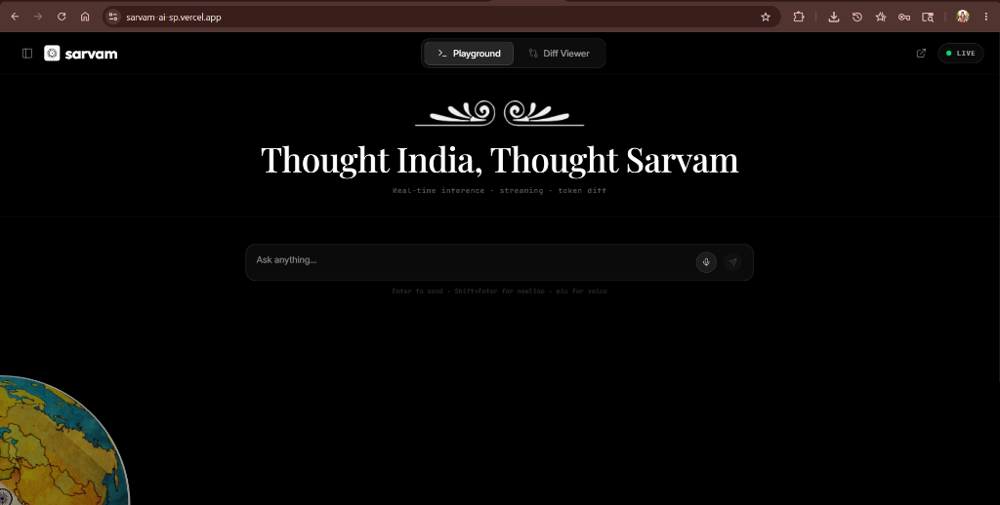
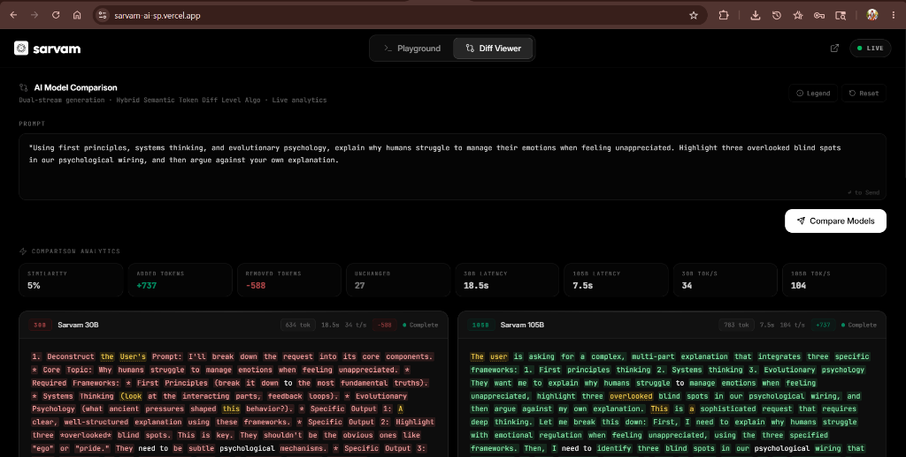

<div align="center">
  
  <p><em>Playground Tab</em></p>
  <br/>
  
  <p><em>Diff Viewer Tab</em></p>
</div>

<div align="center">
  <h1>Sarvam AI Playground</h1>
  <p><em>A real-time conversational AI playground with streaming inference, voice interaction, and a custom token-level response diff engine optimized for LLM outputs.</em></p>
  
  <p>
    <a href="https://sarvam-ai-sp.vercel.app"><b>Deployed Website Link</b></a>
  </p>

</div>

---

## 2. Project Overview

The Sarvam AI Playground is a production-grade infrastructure tool designed for developers and researchers to interact with, evaluate, and directly compare large language models. Built with a streaming-first architecture, the platform enables real-time token generation, dual-stream model comparison, and highly resilient conversational state management.

By seamlessly integrating Sarvam's AI inference APIs (30B and 105B parameter models), the project provides an enterprise-ready environment to benchmark latency, throughput (tokens/second), and semantic variance in real-time.

## 3. Why This Project Exists

Traditional text diff visualization tools were built for source code, making them inherently poorly optimized for:
* **Streamed LLM outputs** where content arrives incrementally.
* **Conversational responses** where human readability is paramount.
* **Evolving token generation** where models frequently rephrase or restructure entire paragraphs.

This project explores a modern, AI-native approach to response comparison. Rather than focusing on mathematically minimal edit scripts (which often produce unreadable "Frankenstein" sentences), this infrastructure introduces a **streaming-aware token evolution algorithm** that visualizes ideational differences between models in a clean, human-readable format.

## 4. Key Features

* **Real-time Streaming Inference:** High-throughput token rendering with auto-scrolling and chunk stabilization.
* **Voice Input + Transcription:** Integrated speech-to-text capabilities for hands-free prompt engineering.
* **Sticky Conversational Composer:** A persistent, highly responsive input layer mapped to global keyboard shortcuts.
* **Custom Token-Level Diff Engine:** A purpose-built algorithm tailored for generative text comparison.
* **Sarvam 30B vs 105B Comparison:** Side-by-side benchmarking of enterprise-scale language models.
* **Real-time Analytics:** Live latency tracking, token velocity (T/s), and generation metrics.
* **WCAG AA Accessibility:** Fully keyboard-navigable UI with ARIA support and visible focus states.
* **Graceful Stream Interruption:** Robust handling of network aborts while preserving partial output states.
* **Chat History Persistence:** LocalStorage-backed conversational state management for session continuity.
* **Enterprise Dark UI:** A polished, high-contrast, professional-grade aesthetic.

## 5. Custom Diff Algorithm: Hybrid Semantic Token Diff Level Algorithm

This project completely abandons standard diffing algorithms in favor of a custom engine: **Hybrid Semantic Token Diff Level Algorithm**.

**This is NOT LCS (Longest Common Subsequence).**
**This is NOT Myers Diff.**
**This is NOT a wrapper around an existing diff library.**

Traditional algorithms generate minimal edit distance scripts. While mathematically optimal, they produce highly fragmented, unreadable outputs when applied to natural language (e.g., matching the "th" in "the" with the "th" in "there"). 

Our custom algorithm uses:
* **Sliding Token Windows:** Comparing contextual chunks of text rather than isolated characters.
* **Local Contextual Alignment:** Matching phrases based on semantic continuity.
* **Similarity Scoring:** Intelligently determining when a sentence has been rephrased versus entirely replaced.
* **Streaming-Aware Token Comparison:** Processing diffs progressively as chunks stream in over the wire.
* **Conversational Readability Prioritization:** Ensuring the resulting diff looks like a clean, human-edited document, not a git merge conflict.

## 6. Architecture

The system is built on a unidirectional, streaming-first data flow:

```text
User Input (Keyboard / Voice)
      ↓
Streaming API Layer (SSE)
      ↓
Response Stream Manager (AbortController & Chunk Assembly)
      ↓
Hybrid Semantic Token Diff Engine
      ↓
Analytics Engine & UI Visualization
```

## 7. Streaming System

To handle the unpredictable nature of live LLM inference, the application relies on a hardened, streaming-first architecture. 

**Production-Grade Engineering Details:**
* **Stream Interruption Handling:** Managed via `AbortController` to cleanly sever active network requests without memory leaks.
* **Preserved Partial Outputs:** If a network failure occurs, or the user manually halts generation, the partially streamed tokens are instantly captured and persisted.
* **Graceful Network Recovery:** Resilient timeout handling for delayed chunks or connection drops.
* **Incremental Rendering:** Minimized React re-renders by throttling state updates to match monitor refresh rates (`requestAnimationFrame` logic), ensuring 60 FPS scrolling even during rapid token floods.
* **Scroll Stabilization:** Anchor-based scrolling keeps the user's viewport locked to the latest token without jarring jumps.

## 8. Accessibility + Reliability

Enterprise tooling must be usable by all engineers. The playground strictly adheres to **WCAG AA Compliance**:
* **Keyboard Navigation:** Full `Tab` navigation support, with `Escape` to close modals and `Ctrl+Enter` / `Enter` shortcuts cleanly mapped.
* **Accessible Focus States:** High-contrast `focus-visible` rings on all interactive elements.
* **ARIA Support:** Dynamic `aria-live="polite"` regions for streaming content ensures screen readers can announce arriving tokens without overwhelming the user.
* **State Recovery:** Hard refreshes instantly restore the exact conversational state via robust LocalStorage hydration.

## 9. Tech Stack

* **Frontend:** React 18, TypeScript, Vite
* **Styling:** Tailwind CSS, Framer Motion, clsx
* **Icons:** Lucide React
* **Data Flow:** Server-Sent Events (SSE), Web APIs (AbortController)
* **Storage:** LocalStorage (Session Hydration)
* **AI Integration:** Sarvam AI APIs
* **Algorithms:** Custom Hybrid Semantic Token Diff Engine

## 10. Screenshots / Preview

*Placeholders for additional specific product features:*

* **Playground UI:** ``
* **Diff Viewer:** ``
* **Streaming Generation:** ``
* **Token-Level Comparison:** ``

## 11. Local Development

**Prerequisites:** Node.js (v18+)

```bash
# 1. Clone the repository
git clone https://github.com/SUJALSPATEL/Sarvam-AI.git
cd Sarvam-AI

# 2. Install dependencies
npm install

# 3. Configure environment variables
cp .env.example .env

# 4. Start the development server
npm run dev
```

## 12. Environment Variables

Create a `.env` file in the root directory:

```env
VITE_SARVAM_API_KEY=your_production_api_key_here
```

*Note: Ensure your API key has appropriate quota limits enabled for the 105B parameter model if running extensive benchmarks.*

## 13. Deployment

The project is optimized for modern edge deployment platforms.

**Vercel / Next.js:**
```bash
npm run build
# Deploy the /dist directory
```

**Docker (Optional):**
A standard Nginx container serving the static `/dist` bundle is highly recommended for Kubernetes-based enterprise environments.

## 14. Future Improvements

* **WebSockets / gRPC:** Transitioning from SSE to full duplex protocols for reduced TTFT (Time To First Token).
* **Multi-modal Support:** Extending the diff engine to support image/vision token descriptions.
* **Local LLM Execution:** WebGPU integration for running smaller quantized models (e.g., Llama-3-8B) entirely client-side.

## 15. License

Copyright © 2026. All rights reserved.
